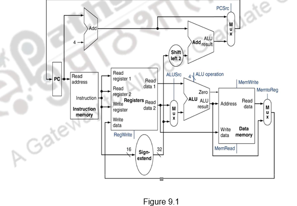
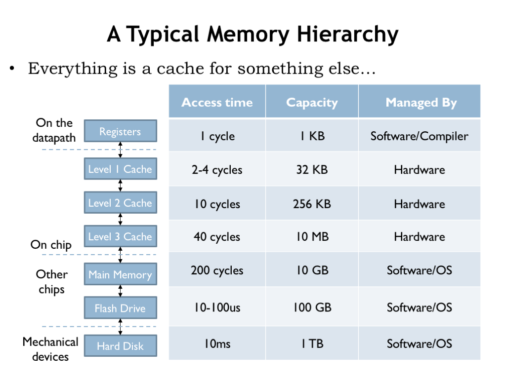

# CPU와 RAM

## 목차

- [하드웨어 구성요소](#하드웨어-구성요소)
  - [CPU](#cpu)
  - [RAM](#ram)
  - [Memory 계층 구조](#memory-계층구조)
- [clock](#clock)
- [프로그램과 프로세스](#프로그램과-프로세스)
  - [프로그램](#프로그램)
  - [프로세스](#프로세스)

---

## 하드웨어 구성요소

- CPU (Central Processing Unit)
- RAM (Random Access Memory)
- HDD / SSD
- mainboard
- power
  - 정격전압을 주기위해 필요하다.

### CPU

#### CPU overview

- 레지스터
- instruction memory
- ALU

#### CPU에서 수행하는 일 (arithmetic 또는 Logical 연산일 때)

- PC(Program Counter - 현재 수행할 instruction을 가리키고 있는 레지스터)가 가리키고 있는 현재 수행되고 있는 Process의 code 영역에 저장된(또는 운영체제의 kernel code) instruction을 읽어 온다.
- 읽어들인 코드는 instruction memory에 저장한다.
- 해당 instruction에 필요한 레지스터 값들을 읽어서 ALU로 보낸다.
- ALU - arithmetic 또는 logical 연산을 수행한다.
- 또한 PC+4를 하는데, 이는 어셈블리 코드가 한줄에 4바이트이므로 다음줄로 넘어가기 위함이다.

### RAM

- 주 기억장치(메모리)
- byte-addressable array (메모리 접근의 최소 단위가 Byte임을 의미)
- 메모리에 주소를 mapping하기 위해서 32bit또는 64bit사용하고 몇 bit를 사용하느냐에 따라 32bit 운영체제 혹은 64bit운영체제라고 표현한다.

### Memory 계층구조

CPU에 가까운 순서 - 각 메모리별로 소요하는 cycle이 다르며 CPU의 효율적인 사용을 위해 메모리에 계층이 존재한다.

1. Register (1cycle)
2. L1 Cache (2-4 cycle)
3. L2 Cache (10 cycle)
4. Memory (DRAM) (200 cycle)
5. HDD/SSD (10ms)

---

## Clock

- Clock: 디지털 장치들의 sync를 맞추는 전기적 신호를 Clock이라고 한다.
- 전류가 흐르는 상태인 ON, 흐르지 않는 상태인 OFF가 반복되는 전류의 흐름을 클럭 주파수(Clock Frequency)라고 하는데, 줄여서 Clock 이라고 한다.
- 하나의 클럭 주기가 지나면 반드시 1개의 비트가 옮겨진다.
- 1번의 Clock이 1 cycle이다.
- 클럭 속도(Clock Speed)는 CPU, 메모리 등 장치의 성능을 나타내는 지표 중 하나이다. 1초에 처리 가능한 Clock cycle을 GHz 단위로 표시한다.
- 메인보드나 그래픽 카드, CPU, 메모리 등 모두 디지털 장치이므로 작동하려면 Clock이 있어야 한다.
  - 메모리별로 소요하는 cycle이 다르며 효율적인 처리를 위해 메모리 계층이 존재한다.
    

---

## 프로그램과 프로세스

### 프로그램

- 보조 기억장치(HDD/SSD) - Executable file

#### 프로그램이 실행되면 무슨 일이 일어날까?

- 운영체제가 HDD나 SSD같은 보조 기억장치에 저장되어 있는 프로그램(Program)을 실행시키면 해당 프로그램은 프로세스 단위로 주기억 장치인 메모리에 올라가게 된다.

### 프로세스

- 주 기억장치(Memory)에 현재 실행중인 프로세스(Process)의 구성요소 - Stack, Heap, Constant, (Static, global), Code
- 프로세스에 할당된 메모리는 5가지 영역으로 관리된다.
  - code(binary code)
  - user data(heap, constant, (global, static))
  - stack(for supporting procedures(local variable, function call, ...))
    - 변수는 프로세스의 스택공간에 저장된다(Stack Pointer(%rsp register)와의 거리를 이용해서 저장되기 때문에 변수 이름으로 저장되지는 않음 (in assenbly level))
    - 만약, 포인터 변수를 선언하게 된다면 포인터 변수는 스택공간에 할당되고, 포인터 변수에 저장하기 위해 Dynamic memory allocation을 한 경우 힙 공간에 메모리가 할당된다. 또한 포인터 변수에는 heap공간에 할당된 메모리의 주소를 저장함으로써 heap공간을 접근 할 수 있게 한다.
  - heap(for supporting dynamic memory allocation)

---

## 추가 정보

### C언어 컴파일 자세히 들여다보기

- C code -> binary file로 만드는 과정이다.
- 컴파일 과정은 통상적으로 Complie과 Linking과정을 모두 포함한다.
- Linking은 여러 오브젝트 파일(binary file)을 하나로 합치는 과정이다.

- elf -> excutable and linkable file
  - 실행파일인지 아닌지 확인 (readelf -l 파일명)
  - 구분 방법: 파일 선두에 매직바이트로 실행가능한지 표시 되어 있음

### 파이썬 변수 선언 동작 원리

- 파이썬은 그 내부가 C언어로 구현되어 있다.
- 파이썬에서 변수가 선언되면 포인터 변수로 스택에 할당되고 힙 공간에 동적 할당이 이루어진다.
- 포인터 변수는 변수의 정보를 구조화한 구조체(메타데이터로 기능)의 헤드를 가리키고, 이 헤드는 할당된 힙 공간을 가리킨다.
